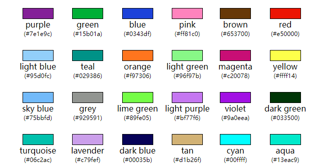

# Graph Network Learning

 图机器学习记录。

## 图机器学习代码基本使用方法

### 1. 环境配置

#### （1）python环境

python：[https://www.python.org/](https://www.python.org/)

也可以使用anaconda管理python环境：[https://www.anaconda.com/](https://www.anaconda.com/)

#### （2）主要工具包

* networkX ：网络工具包，用于创建分析各种图和网络。[https://networkx.org/](https://networkx.org/)
* pytorch ：神经网络工具包。[https://pytorch.org/](https://pytorch.org/)
* matplotlib ：科学绘图工具包，用于数据可视化。[https://matplotlib.org/](https://matplotlib.org/)
* numpy ：数学函数库，主要用于矩阵运算。[https://numpy.org/](https://numpy.org/)
* pandas ：数据分析和处理库，主要用于导入和处理数据。[https://pandas.pydata.org/](https://pandas.pydata.org/)
* tqdm ：python自带进度条工具包。

#### （3）测试环境

```python
# 代码：Code_图机器学习基本使用\A1_配置环境.py
```

### 2. NetworkX基本使用方法

NetworkX基本使用方法。

参考文献：[https://networkx.org/documentation/stable/auto_examples/index.html](https://networkx.org/documentation/stable/auto_examples/index.html)

#### （1）创建图，NetworkX内置图

使用NetworkX创建图。

NetworkX内置了一些预制好的图结构和图数据。

参考文献：

* 图的类型：[https://networkx.org/documentation/latest/reference/classes/index.html](https://networkx.org/documentation/latest/reference/classes/index.html)
* NetworkX内置的图：[https://networkx.org/documentation/latest/reference/generators.html](https://networkx.org/documentation/latest/reference/generators.html)
* 一些例子：[https://networkx.org/documentation/latest/auto_examples/graph/index.html](https://networkx.org/documentation/latest/auto_examples/graph/index.html)

```python
# 代码：Code_图机器学习基本使用\A2_创建图NetworkX内置图.py
```

#### （2）创建图，使用连接表和邻接表创建图

使用NetworkX，通过连接表和邻接表创建图，保存一个图的邻接表，通过邻接矩阵创建图。

参考文献：

* 格式转换：[https://networkx.org/documentation/latest/reference/convert.html](https://networkx.org/documentation/latest/reference/convert.html)
* 读写图：[https://networkx.org/documentation/latest/reference/readwrite/index.html](https://networkx.org/documentation/latest/reference/readwrite/index.html)

数据来源：

* 中国四大名著人物关系知识图谱：[http://www.openkg.cn/dataset/ch4masterpieces](http://www.openkg.cn/dataset/ch4masterpieces)

连接表：可以理解成记录了每一条边的表格，表格一般3列，第一列是头节点，第二列是尾节点，第三列是连接的名字或属性。

邻接表：可以理解成记录每个节点与其他节点关系的表格，表格第一列是每个节点，每个节点后面的列分别记录与其有连接的其他节点，有向图的话第一列都作为头节点。

邻接矩阵：以n*n的矩阵记录邻接关系，n为节点数，如果第m个节点和第n个节点有连接关系，则临界矩阵的第m行n列的数值不为0。

```python
# 代码：Code_图机器学习基本使用\A3_创建图_连接表和邻接表创建图.py
```

#### （3）创建节点

使用NetworkX创建单个节点、多个节点，添加并访问节点的属性。

在 NetworkX 中，节点可以是任何可哈希([hashable](https://link.zhihu.com/?target=https%3A//docs.python.org/3/glossary.html%23term-hashable))对象，例如，文本字符串、图像、XML对象、另一个图、自定义节点对象等。

在 NetworkX 中，节点的属性是一个python字典，因此可以使用字典操作的方法对节点属性进行操作。

参考文献：

* 创建图基础：[https://networkx.org/documentation/stable/tutorial.html](https://networkx.org/documentation/stable/tutorial.html)
* 更改图、节点、边的属性：[https://networkx.org/documentation/stable/tutorial.html#attributes](https://networkx.org/documentation/stable/tutorial.html#attributes)

```python
# 代码：Code_图机器学习基本使用\A4_创建节点.py
```

#### （4）创建连接

使用NetworkX创建连接，添加并访问连接的属性，本文中"连接"和"边"会混用，代表一个意思。

NetworkX可以创建无向图（Graph），有向图（Directed Graph），带权重的图（Weighted Graph）和多路图（MultiGraph）。

参考文献：

* 图的类型：[https://networkx.org/documentation/latest/reference/classes/index.html](https://networkx.org/documentation/latest/reference/classes/index.html)

NetworkX创建连接的方式和节点相似，可以参考节点的相关部分。

```python
# 代码：Code_图机器学习基本使用\A5_创建连接.py
```

### 3. NetworkX图的可视化方法

使用NetworkX和matplotlib可视化图。

#### （1）NetworkX的可视化函数

参考文献：

* draw函数中的参数：[https://networkx.org/documentation/stable/reference/generated/networkx.drawing.nx_pylab.draw.html](https://networkx.org/documentation/stable/reference/generated/networkx.drawing.nx_pylab.draw.html)
* 更多的设置参数：[https://networkx.org/documentation/stable/reference/generated/networkx.drawing.nx_pylab.draw_networkx.html#](https://networkx.org/documentation/stable/reference/generated/networkx.drawing.nx_pylab.draw_networkx.html#)
* 一些例子：[https://networkx.org/documentation/stable/auto_examples/drawing/index.html](https://networkx.org/documentation/stable/auto_examples/drawing/index.html)
* 常用的颜色：[xkcd.com/color/rgb/](https://xkcd.com/color/rgb/)

xkcd调色盘：见上链接，可以在matplotlib中直接使用的900多种常用色，使用方法如下

```python
color='xkcd:red'
```



```python
# 代码：Code_图机器学习基本使用\B1_NetworX图可视化.py
#       Code_常用代码\T100_NetworkX画图模板.py
```

#### （2）图可视化例子，美国128城市交通关系无向图

参考文献：

* 数据源文件：[https://networkx.org/documentation/stable/auto_examples/drawing/plot_knuth_miles.html](https://networkx.org/documentation/stable/auto_examples/drawing/plot_knuth_miles.html)

```python
# 代码：Code_图机器学习基本使用\B2_例子_美国128城市交通连接图.py
```

#### （3）有向图可视化

参考文献：

* 可视化例子：[https://networkx.org/documentation/latest/auto_examples/drawing/plot_directed.html#sphx-glr-auto-examples-drawing-plot-directed-py](https://networkx.org/documentation/latest/auto_examples/drawing/plot_directed.html#sphx-glr-auto-examples-drawing-plot-directed-py)

```python
# 代码：Code_图机器学习基本使用\B3_有向图可视化.py
```

#### （4）多路图(MultiDiGraph)可视化例子，国际象棋对局

对多路图可视化的例子，数据1886-1985年国际象棋冠军赛对局，节点大小表示胜利次数，边的宽度表示对局次数

参考文献

* 可视化例子：[https://networkx.org/documentation/latest/auto_examples/drawing/plot_chess_masters.html#sphx-glr-auto-examples-drawing-plot-chess-masters-py](https://networkx.org/documentation/latest/auto_examples/drawing/plot_chess_masters.html#sphx-glr-auto-examples-drawing-plot-chess-masters-py)
* 数据源：[https://chessproblem.my-free-games.com/PGN/WCC.zip](https://chessproblem.my-free-games.com/PGN/WCC.zip)

```python
# 代码：Code_图机器学习基本使用\B4_例子_国际象棋对局.py

# 注意：这个代码有一个坑，在使用matplotlib新建figure的时候，不能先于networkx的kamada_kawai_layout执行，否则会报错，原因不明。
# 这样执行会报错
fig,ax = plt.subplots(figsize=(12, 12))
pos = nx.kamada_kawai_layout(G)
# 这样执行可以正常运行
pos = nx.kamada_kawai_layout(G)
fig,ax = plt.subplots(figsize=(12, 12))
```
